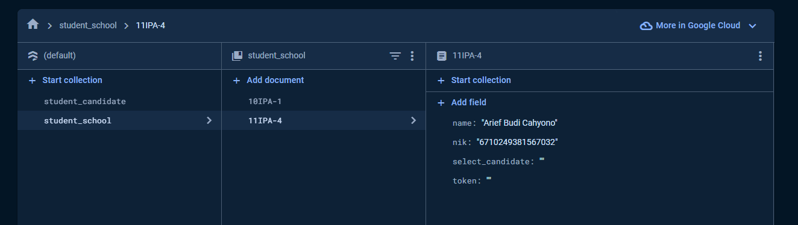
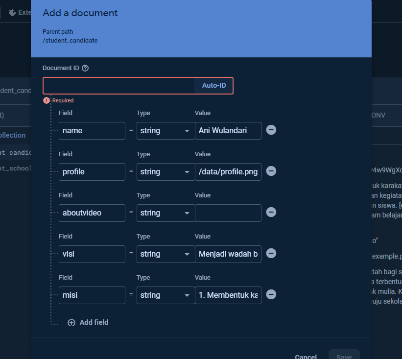
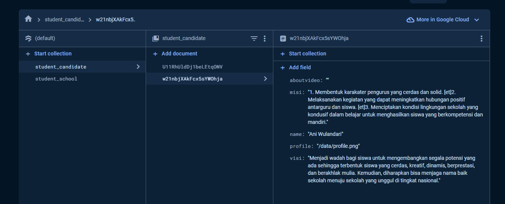

# TOLONG BACA FILE INI SEBELUM MEMULAI MENJALANKAN PROGRAM !

> Baca detail ini untuk menyesuaikan perintah pada program

## 1. Lakuan configuration pada file .env atau environment process untuk menjalankan

Jika kamu membuka file .env.example terlihat seperti gambar dibawah ini, silahkan copy dan paste, lalu masukan sesuai perintah seperti contohnya


Contoh pengisian:

```bash
## ---- FIREBASE DATABASE ----
FIREBASE_APIKEY="AIza..."
FIREBASE_AUTHDOMAIN="{project}.firebaseapp.com"
FIREBASE_PROJECTID="{project}"
FIREBASE_STORAGEBUCKET="{project}.appspot.com"
FIREBASE_MESSAGINGSENDERID="1234567890"
FIREBASE_APPID="1:1234567890:web:3412....."
FIREBASE_MEANSURENTID="G-JX....."
## ---- AUTH DASHBOARD LOGIN ----
DASHBOARD_AUTH_ADMIN="admin.sma1kotaeal@sekolah.id"
DASHBOARD_AUTH_PASSWORD="AdminSekolah1422314s"
## ---- TIME STARTED ----
START_VOTE="2024-02-02 08:30"
TIME_VOTE="21600000"
```

## 2. Buat firebase project dan buka firestore

Buka [halaman google firebase](https://console.firebase.google.com/) untuk membuat project, klik "Add Project" lalu lanjutkan tahap tahapnya.

Jika sudah buka tab firestore database, lalu buat setupnya dan semuanya, pastikan file .env atau environment process pada firebase yang sama.

Lalu masukan data siswa dengan nama koleksi "student_school" dan membuat koleksi para calon kandidat dengan nama "student_candidate"

pada koleksi student_school harus mempunya object dan id sesuai dengan urutan dibawah ini atau lihat contoh pada gambar

Contoh object :

```json
{
  "$_id": "{ID KELAS}-{ABSEN}", // String (default)
  "data": {
    "name": "{NAMA SISWA}", // String
    "nik": "{NIK SISWA}", // String
    "token": "" // String (data ini disini lewat dashboard)
    "select_candidate": "" // String (data ini bawaan sebelum vote harus kosong)
  }
}
```

Contoh data gambar :



Lalu isi form pada bagian "student_candidate" untuk membuat opsi vote.

Pada bagian id, pastikan generate sendiri bisa via form pada tombol "Auto-ID" saat mengisi seperti gambar dibawah



Masukan data siswa kandidat seperti dibawah ini

Contoh object :

```json
{
  "$_id": "{GENERATE_ID}",
  "data": {
    "name": "", // String (nama lengkap)
    "profile": "", // String (lokasi foto profile)
    "aboutvideo": "", // String (id video youtube, tidak harus)
    "visi": "", // String (gunakan [et] atau [br] untuk membuat spasi)
    "misi": "" // String (gunakan [et] atau [br] untuk membuat spasi)
  }
}
```

Contoh data gambar :

